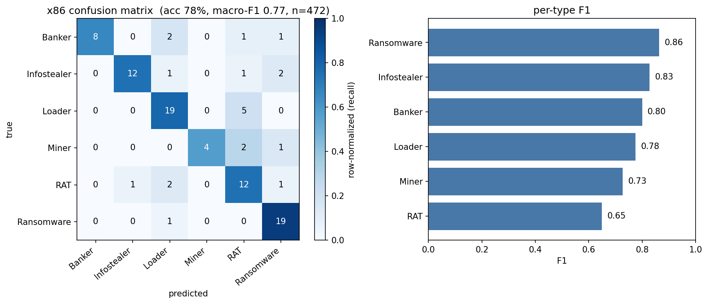

# malfamily

malfamily is a simple static-analysis tool that classifies a malware binary by behavioral
type, choosing among infostealer, ransomware, RAT, loader, banker, and miner. Ghidra
disassembles the file, the stream of instruction mnemonics becomes a frequency histogram,
and a Random Forest classifies that histogram. It works on PE and ELF, and Mach-O support is
still in progress.

## Setup & usage

Clone the repository and install the Python dependencies.

```
git clone https://github.com/jiacwng/malfamily.git
cd malfamily
python -m venv .venv
source .venv/bin/activate      # Windows: .venv\Scripts\activate
pip install -r requirements.txt
```

Training runs on the features that ship with the repository, so numpy and scikit-learn
are enough.

```
python -m ml.train
```

That command prints the full evaluation report and writes the model to `ml/model_x86.pkl`.

Classifying a fresh binary additionally requires Ghidra (11+) and a JDK (21+), with
`GHIDRA_INSTALL_DIR` and `JAVA_HOME` set to their locations.

```
python -m ml.predict suspicious.exe
```

The tool prints one line per file, so a confident result, a low-confidence result and an
unreadable file look like the following.

```
suspicious.exe: Ransomware (94%), 2nd: Loader (3%) -- x86
dropper.bin: RAT (38%), 2nd: Loader (26%)  [LOW CONFIDENCE, margin 0.12] -- x86
packed.bin: UNANALYZABLE (likely packed) -- x86, entropy 7.89, 71% Out of Vocabulary, 84 instr
```

## Results

The model is trained on 472 samples across the six types, deduplicated by feature vector and
split 80/20 into train and test, and because the class sizes are uneven, with Ransomware and
Loader the largest and Miner the smallest, `class_weight="balanced"` compensates as described
below.

- Accuracy **77.9%**, against a majority-class baseline of **25.3%**
- Macro-F1 **0.77**

| Type        | Precision | Recall | F1   |
|-------------|-----------|--------|------|
| Ransomware  | 0.79      | 0.95   | 0.86 |
| Infostealer | 0.92      | 0.75   | 0.83 |
| Banker      | 1.00      | 0.67   | 0.80 |
| Loader      | 0.76      | 0.79   | 0.78 |
| Miner       | 1.00      | 0.57   | 0.73 |
| RAT         | 0.57      | 0.75   | 0.65 |




The matrix is colored by row, so the diagonal shows recall per type, and most of the
confusion sits between RAT and Loader.

Each prediction carries a confidence margin, the gap between the top two class probabilities,
so a wide gap means a reliable call, but a narrow gap is flagged as low-confidence to keep
borderline predictions visible in the output, and on the held-out set predictions with a
margin above 0.25 were correct 92% of the time.

## Data pipeline & features

Samples come from [MalwareBazaar](https://bazaar.abuse.ch/), but only the extracted features
are committed, so the samples themselves stay out of the repository.

```
python -m data.fetch_samples --family Vidar --limit 50
```

The repository ships the extracted features as a single bundle, `data/features_x86.npz`, so
training runs without Ghidra or any local samples, and `python -m ml.train --rebuild`
regenerates the dataset from the local cache.

The path from a file to a prediction runs through a few stages.

```
core/parser.py      runs Ghidra, pulls out functions and their mnemonics
core/extractor.py   turns the mnemonics into a feature vector
ml/dataset.py       builds the (X, y) matrix from features and labels
ml/classifier.py    the Random Forest (train, predict, evaluate)
ml/train.py         runs the whole thing and prints the report
ml/predict.py       classifies a single file
```

Each instruction mnemonic is mapped to a root, a normalized form of the mnemonic, and the
roots are grouped into semantic categories such as arithmetic, control flow, and memory
access, so the file collapses into two frequency histograms, one over roots and one over
categories, each normalized by the number of recognized instructions, and those two
histograms form the feature vector. The extractor also records the share of instructions
whose mnemonic matched nothing in the vocabulary, so the quality gate uses that share to flag
a file as unreadable, but a high unrecognized share is only an ambiguous signal, because
although it can point to packing, where junk bytes disassemble into nonsense, an ordinary
binary that uses instructions outside the vocabulary raises it too.

A sample's label is the type that its family maps to, defined by a table in `ml/dataset.py`,
and because the download step is the only stage that knows a sample's family with certainty,
the labels are decided there.

## Project evolution & decisions

A few aspects of the design changed while I built it.

**From family to type.** The first model predicted the exact family, such as Vidar, Stop, or
AgentTesla, and it reached roughly 90% across eight families, but a family model can only
recognize families it has already seen, so predicting the broader type generalizes better to
new malware, since an unfamiliar stealer still resembles an infostealer at the instruction
level.

**Uneven class sizes.** The types are not evenly represented, so Ransomware and Loader
dominate while Miner is thin, partly because some families are more available on MalwareBazaar,
and partly because miners are nearly all the same XMRig core, so they deduplicate down to a
few dozen. The Random Forest runs with `class_weight="balanced"`, which weights each class
inversely to its frequency so the rare types still affect the splits, but that only reduces
the bias from the skew and cannot add variety the data lacks, therefore the smaller types stay
less reliable, and I am fetching more samples to even it out.

**No arm64 model in practice.** The design keeps a separate model per architecture, because
x86 and arm64 produce feature vectors of different widths, but for now only the x86 model is
trained, since I have not gathered a real arm64 corpus yet, so I am in the process of fetching
more arm64 samples.

**Limited Mach-O data.** Well-labeled Mach-O samples are difficult to obtain, so as a stopgap,
when a macOS binary is a universal (fat) file, Ghidra reads its x86-64 slice, and those
samples are folded in as ordinary x86 families, which keeps the design faithful to Mach-O
support while remaining simple, but I am still fetching more macOS data.

**Inspired by mnemocrypt.** The project grew out of
[mnemocrypt](https://github.com/theneonai/mnemocrypt), which I worked on for a semester
project, so I wanted something of my own that ran end to end, from raw binaries through
parsing and feature processing into a trained model, and its pipeline of mnemonic roots,
semantic categories, and a Random Forest was a natural starting point, but the implementation
here built from the same ideas with a more separated pipeline.

## Limitations

- Because the analysis is static, packing or obfuscation can hide the real code and degrade
  the prediction, and I tried to filter packed files with an entropy threshold, but the
  boundary between normal high-entropy data and genuine packing is hard to pin down, so it
  works only as a rough heuristic, and a sturdier replacement is noted under future work.
- .NET assemblies and heavily packed files disassemble into very little native code, so the
  model has little to read and returns `unanalyzable` together with the evidence, which is why
  .NET-heavy families were excluded from training.
- The dataset is modest, 472 samples after deduplication and unevenly spread across types,
  with Miner the thinnest, so the numbers are a reasonable baseline, but production accuracy
  would require considerably more data, especially for the smaller types.
- Mnemonic histograms are a coarse signal, so behaviorally similar types can be confused, and
  RAT is the clearest case, since it overlaps with Loader because both are staging and delivery
  code, therefore it stays the weakest type in evaluation.

## Future work

The clearest next step is to pair the static features with dynamic ones, so I want to add a
stage that runs the binary inside a virtual machine, captures the information it dumps at
runtime, and feeds that to the model, because runtime behavior reaches what static
disassembly leaves hidden, especially for the packed and .NET samples that the current
pipeline cannot read.

A smaller improvement is the way packing is detected, since the entropy threshold is only a
crude pre-check that cannot tell compressed resources from a genuine packer, so I want to
replace it with a signal Ghidra can measure directly, the share of executable section bytes
that actually disassemble into instructions, because a packed file recovers almost no real
code whatever its entropy. I have left it for later because computing it means re-running
Ghidra across the whole corpus to refill the feature cache.

All analysis is static, and samples are not executed. This is a research and learning
project.
